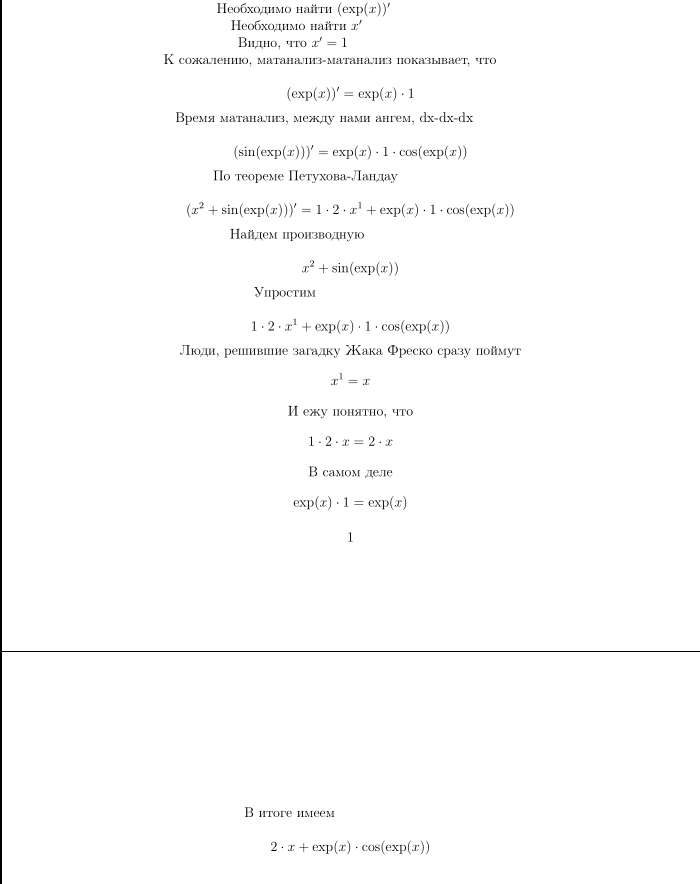

# Differentiator
Программа для нахождения производных функций с
выводом хода её нахождения.

## Использование

```bash
./Differentiator "f(x)"
# Например
./Differentiator "x ^ 2 + sin(e ^ x)"
```

pdf с выводом производной появляется в папке tex/


Или можно вводить функции через стандартный ввод:
```bash
./Differentiator
x ^ 4 - cos(tan(exp(x)))
```

## Как работает
Выражение парсится с помощью алгоритма рекурсивного
спуска. Полученное дерево упрощается,
дифференцируется, снова упрощается и выводится в
техе. Обработка дерева логируется изображениями
дерева, генерируемыми с помощью Graphviz Dot.